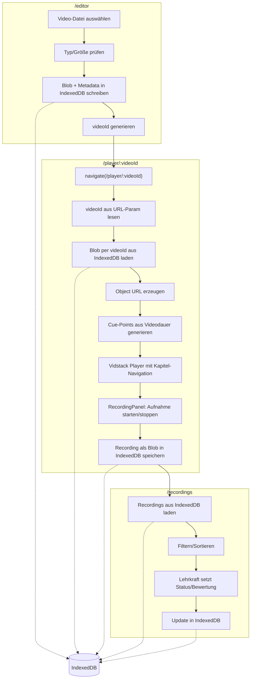

# Boardstory-Player

Clientseitiger Player für animierte, vertonte Bilderbücher (siehe CONTEXT.md).

## Architektur

Der Player läuft vollständig clientseitig, ohne Backend ([ADR-0001](./docs/adr/0001-client-side-only-no-backend.md)).
IndexedDB übernimmt die Rolle der Persistenzschicht für Video-Blobs und Recordings.

## Tech-Stack

Aufbauend auf React + Vite ([ADR-0002](./docs/adr/0002-react-vite-frontend.md)):

**Player-Framework: [Vidstack](https://vidstack.io/)** (`@vidstack/react`) — bringt barrierearme, headless
Player-Primitives (Play/Mute-Buttons, Time-/Volume-Slider) mit, auf denen die Kapitel-Navigation über Cue-Points
([ADR-0004](./docs/adr/0004-auto-generated-cue-points.md)) aufsetzt, statt sie über natives `<video>` selbst
nachzubauen.

- _Considered:_ natives HTML5-`<video>` + eigene Controls — verworfen, da Play/Pause/Slider/Zeitanzeige inkl.
  Tastatur-/Screenreader-Zugänglichkeit komplett selbst gebaut werden müssten, Mehraufwand ohne Nutzen im 3-Tage-Rahmen.
- _Considered:_ Plyr, Video.js — verworfen: beide sind auf ein DOM-nahes, imperatives API ausgelegt statt auf
  deklarative Framework-Komponenten; Vidstack passt direkter zu React (ADR-0002) und bietet dieselbe Anbindung auch für
  Svelte/Vue, falls der Player-Layer je vom Framework getrennt würde.

**Styling: [Tailwind CSS](https://tailwindcss.com/)** (`@tailwindcss/vite`) — Utility-Klassen direkt in den
Komponenten, kein separates CSS-Modul-/Datei-Management für die wenigen, meist einmalig verwendeten UI-Elemente
(Player-Controls, Dashboard-Liste).

- _Considered:_ CSS Modules — verworfen: bei der überschaubaren Komponentenzahl dieses Projekts steht der Overhead
  (eigene `.module.css`-Datei pro Komponente, Klassennamen-Mapping) in keinem Verhältnis zum Nutzen (Scoping), den
  Tailwinds Utility-Klassen ohnehin durch Kolokation im JSX vermeiden.
- _Considered:_ styled-components/Emotion (CSS-in-JS) — verworfen: zusätzliche Laufzeit-Abhängigkeit und
  Runtime-Overhead (Style-Injection zur Laufzeit) auf ohnehin schwacher Zielhardware (ADR-0002), ohne dass CSS-in-JS
  hier einen Vorteil gegenüber Utility-Klassen bringt.

**Test-Tooling: [Vitest](https://vitest.dev/) + [Testing Library](https://testing-library.com/)** — Vitest teilt sich
Vites Config/Transform-Pipeline (kein separates Jest-Setup, kein Babel/ts-jest-Umweg), Testing Library erzwingt Tests
über zugängliche Rollen/Labels statt Implementierungsdetails. `fake-indexeddb` simuliert die Persistenzschicht
(ADR-0001/0003) in Node, ohne einen echten Browser zu benötigen.

- _Considered:_ Jest — verworfen: eigene Transform-Pipeline parallel zu Vite (zusätzliche Config, potenziell
  abweichendes Modul-/JSX-Handling), während Vitest Vites Setup direkt wiederverwendet.
- _Considered:_ Playwright/Cypress (E2E) für die Kernflüsse — als Ergänzung erwogen, nicht als Ersatz; im
  3-Tage-Rahmen zurückgestellt zugunsten von Komponenten-/Unit-Tests mit höherer Abdeckung pro investierter Zeit.

## Aufwandsschätzung

Aufteilung des 3-Tage-Rahmens nach Funktionsbereich, mit Bezug auf die zugehörigen Tickets in Github
([#1](../../issues/1)-[#9](../../issues/9)):

| Bereich                                                           | Tickets | Aufwand    | Status                    |
| ----------------------------------------------------------------- | ------- | ---------- | ------------------------- |
| Setup & Architektur-Grundlage (Scaffold, Routing, Tailwind, ADRs) | #1, #2  | 0,5 Tag    | ✅ erledigt               |
| Editor: Upload & Validierung                                      | #3, #4  | 0,5 Tag    | ✅ erledigt               |
| Player: Vidstack-Integration, Cue-Point-Navigation                | #5      | 0,5 Tag    | ✅ erledigt               |
| Recording: Aufnahme-Flow, IndexedDB-Persistenz                    | #6      | 0,5 Tag    | ✅ erledigt               |
| Recordings-Dashboard: Filtern, Sortieren, Bewertung               | #7      | 0,5 Tag    | ✅ erledigt               |
| Doku (dieses README) & Polish (Ladezustand für Routen-Chunks)     | #8, #9  | 0,5 Tag    | 🔄 #8 in Arbeit, #9 offen |
| **Gesamt**                                                        |         | **3 Tage** |                           |

## Setup

npm install
npm run dev

## Tests

npm test
